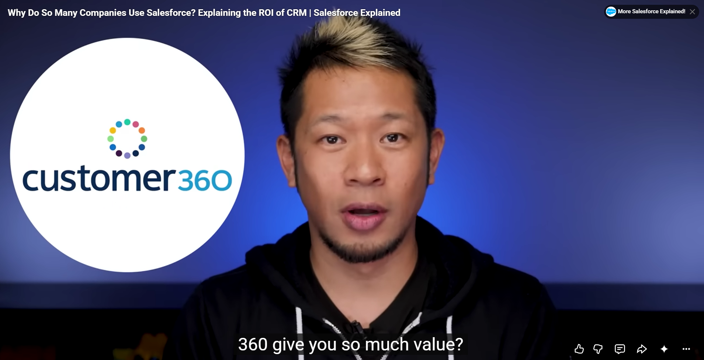
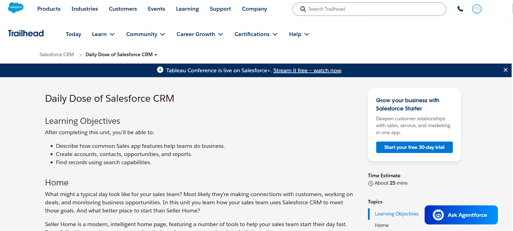
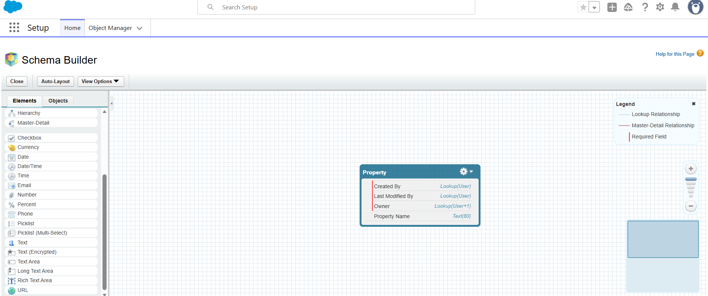

# Day 1 - CRM Basics

## Overview

This folder contains my Day 1 work for the Salesforce Summer Training Program.

On Day 1, I learned the basics of Salesforce CRM, why companies use Salesforce, important Salesforce objects, CRM business flow, real-world CRM mapping, and basic Salesforce platform features like Object Manager, Fields & Relationships, and Schema Builder.

---

## 1. What is CRM?

CRM stands for **Customer Relationship Management**.

CRM is a system used by companies to manage their relationships with customers, leads, clients, and business partners. It helps businesses store customer information, track communication, manage sales, improve customer service, and build stronger customer relationships.

---

## 2. Why Companies Use Salesforce

Salesforce is a cloud-based CRM platform that helps companies manage customers, sales, service, marketing, and business workflows in one place.

Companies use Salesforce because it helps them to:

- Store customer details in one place
- Track leads and opportunities
- Manage sales and customer service
- Automate business processes
- Analyze business performance using reports and dashboards
- Improve customer relationships
- Get a complete customer view using Salesforce Customer 360

---

## 3. Salesforce Objects

Salesforce stores data using objects. Objects are similar to tables in a database. Some important Salesforce objects are Account, Contact, Lead, and Opportunity.

| Object | Meaning | Example |
|---|---|---|
| Account | Represents a company, organization, or institution with which a business has a relationship | Vishnu Institute of Technology, TCS, Amazon |
| Contact | Represents a person related to an account | Student, customer, manager, decision maker |
| Lead | Represents a person or organization interested in a product or service | A student asking about admission details |
| Opportunity | Represents a possible business deal or sale | A student taking admission or a company purchasing software |

---

## 4. CRM Business Flow

The basic CRM business flow is:

Lead → Contact → Opportunity → Customer

| Stage | Description |
|---|---|
| Lead | A person or organization shows interest in a product or service |
| Contact | The lead is verified and converted into a contact |
| Opportunity | A possible deal or transaction is created |
| Customer | The opportunity is completed successfully and the person becomes a customer |

---

## 5. Real-World Mapping: College Admission System

Salesforce CRM concepts can be understood using a college admission system example.

| Salesforce CRM Term | College Admission Example |
|---|---|
| Account | College or educational institution |
| Contact | Student or parent |
| Lead | Student who fills an inquiry form or asks about admission |
| Opportunity | Chance of converting the inquiry into confirmed admission |
| Customer | Student who successfully takes admission |

Other possible objects in a college management system:

- Student
- Faculty
- Course
- Attendance
- Fees

---

## 6. Salesforce Platform Features Explored

| Feature | Purpose |
|---|---|
| Object Manager | Used to manage Salesforce objects, fields, and relationships |
| Fields & Relationships | Used to create and manage data fields inside an object |
| Schema Builder | Used to visually understand the data model and object relationships |
| Trailhead Playground | Used to practice Salesforce concepts in a hands-on environment |

---

## 7. Screenshots

### Screenshot 1 - Salesforce Customer 360 Introduction

This screenshot shows the Salesforce Customer 360 concept, which helps companies get a complete view of their customers.

---

### Screenshot 2 - Salesforce CRM Basics

This screenshot shows the Salesforce CRM learning page.

---

### Screenshot 3 - Schema Builder

This screenshot shows the Salesforce Schema Builder, which is used to view and understand the data model visually.

---

### Screenshot 4 - Object Manager and Fields

This screenshot shows the Object Manager page where fields and relationships of an object can be managed.

---

## 8. Learnings from Day 1

- Learned what CRM means
- Understood why companies use Salesforce
- Learned about Salesforce Customer 360
- Learned about Salesforce objects such as Account, Contact, Lead, and Opportunity
- Understood the CRM business flow from Lead to Customer
- Mapped Salesforce CRM concepts with a college admission system
- Explored Object Manager and Fields & Relationships
- Learned how Schema Builder helps in visualizing Salesforce data models
- Understood the importance of maintaining daily training work using GitHub README files

---

## 9. Doubts / Questions

- What is the difference between standard objects and custom objects in Salesforce?
- How are Salesforce Admin and Salesforce Developer roles different?

---

## Folder Structure

day1-crm-basics/
│
├── README.md
└── screenshots/
    ├── salesforce_intro.png
    ├── salesforce-crm.png
    ├── data_model_basics.png
    └── platform_basics.png
