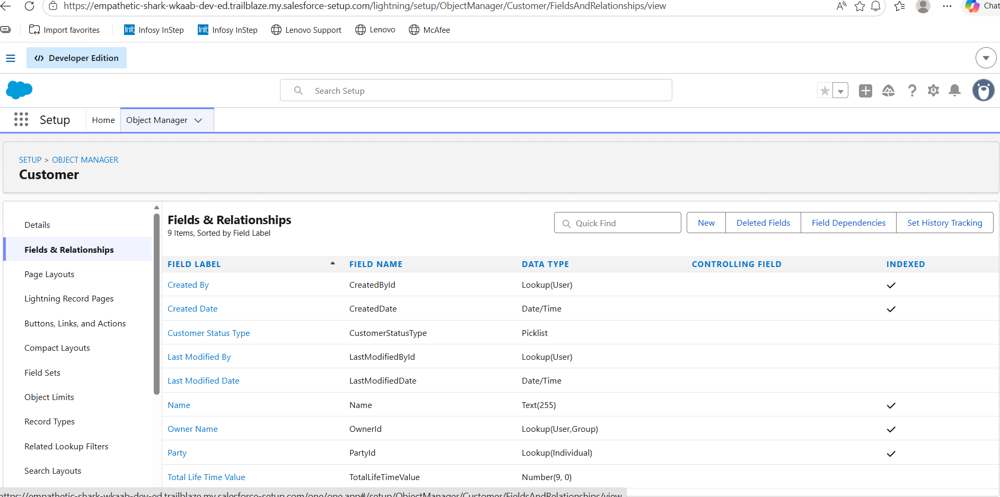
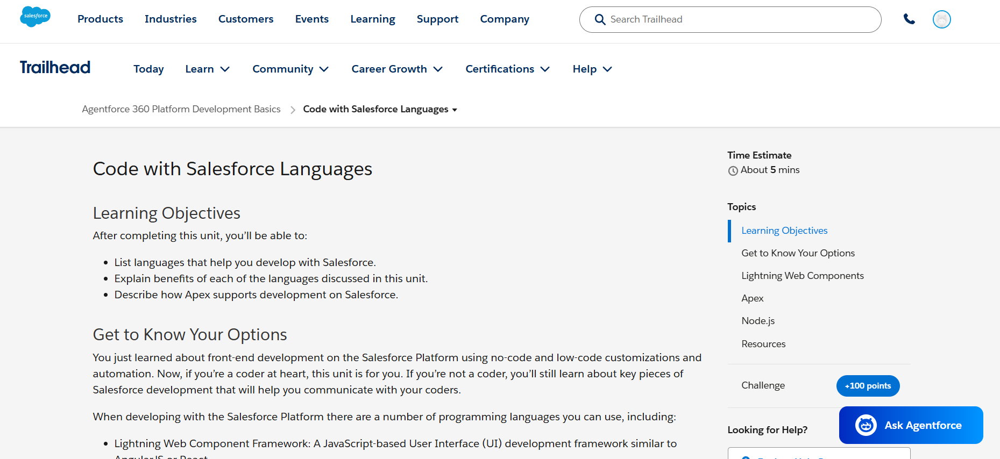

# Day 2 - Salesforce Platform Basics

## 1. What is Salesforce Platform?

Salesforce Platform is a cloud-based platform used to build and manage business applications. It helps companies store customer data, manage business processes, automate tasks, and create custom apps without starting from scratch. Salesforce provides standard features like Accounts, Contacts, Leads, and Opportunities, and developers can also extend it using custom objects, automation, Apex code, APIs, and Lightning components.

---

## 2. CRM Concepts in Salesforce Platform

In Salesforce, CRM concepts are represented using objects and apps.

- Account means an organization, college, hospital, or company.
- Contact means a person related to that Account.
- Lead means a potential customer or enquiry.
- Opportunity means a possible business deal or conversion.

For example, in a College Admission System, a college can be treated as an Account, a student can be treated as a Contact or Lead, and the admission process can be treated as an Opportunity.

---

## 3. What is an App in Salesforce?

An App in Salesforce is a collection of tabs, objects, and features grouped together for a specific business purpose. It helps users access related data and tools in one place.

Example: A College Admission App can contain objects like Students, Courses, Applications, and Payments.

---

## 4. What is an Object in Salesforce?

An Object in Salesforce is like a table in a database. It is used to store a particular type of data.

Example: A Student object stores student details like name, email, phone number, course selected, and admission status.

Types of objects:
- Standard Objects: Already available in Salesforce, like Account, Contact, Lead, Opportunity.
- Custom Objects: Created by users based on business needs, like Student, Course, Admission Application.

---

## 5. What is a Tab in Salesforce?

A Tab is a user interface option used to open and view an object or feature in Salesforce. Tabs help users easily access records.

Example: In a College Admission App, tabs can be Students, Courses, Applications, and Payments.

---

## 6. Difference between App and Object

| App | Object |
|---|---|
| App is a group of related objects and tabs | Object is used to store specific data |
| It is created for a business purpose | It is like a database table |
| Example: College Admission App | Example: Student Object |
| Contains multiple objects | Contains records and fields |

---

## 7. Configuration vs Coding

### Configuration

Configuration means building features in Salesforce using clicks, without writing code. It is used when the requirement can be completed using Salesforce standard tools.

Examples:
1. Creating a custom object like Student.
2. Creating fields like Student Name, Course, Phone Number, and Admission Status.

### Coding

Coding is used when the requirement is complex and cannot be completed using only clicks. Salesforce developers use Apex, Lightning Web Components, APIs, and SOQL for coding.

Examples:
1. Writing Apex code to automatically assign admission applications to counselors.
2. Creating a custom Lightning component to show student admission progress in a special dashboard.

---

## 8. When should we use Configuration instead of Code?

We should use configuration when the requirement is simple, standard, and can be completed using Salesforce built-in tools. Configuration is faster, easier to maintain, and does not need programming.

Example: Creating objects, fields, validation rules, page layouts, and simple automation can be done using configuration.

---

## 9. When should we use Coding?

We should use coding when the business requirement is complex and cannot be achieved using normal Salesforce configuration. Coding is useful for custom logic, integrations, advanced UI, and complex automation.

Example: If a college wants an automatic admission score calculation based on marks, entrance exam rank, category, and course availability, Apex code may be required.

---

## 10. Multi-tenant Architecture

Multi-tenant architecture means many customers use the same Salesforce infrastructure, but their data is kept separate and secure. It is like many students using the same college system, but each student can see only their own details.

This helps Salesforce provide updates, security, and scalability to all customers without each company managing separate servers.

---

## 11. How Salesforce allows Developers to Extend Functionality

Salesforce allows developers to extend functionality using:

- Apex for backend logic
- Lightning Web Components for custom user interfaces
- SOQL to query data
- APIs to connect Salesforce with external systems
- Flows and automation tools for business processes
- Custom objects and fields for specific business needs

---

## 12. My System Design - College Admission System

### App Name

College Admission Management App

### Objects inside the App

| Object Name | Purpose |
|---|---|
| Student | Stores student personal details |
| Course | Stores available course details |
| Admission Application | Stores application details submitted by students |
| Counselor | Stores counselor or admission officer details |
| Payment | Stores fee payment details |

### User Interaction

Students can submit admission applications with their personal and academic details. Counselors can review applications, update admission status, and guide students. Admin users can manage courses, student records, and payment details. The system helps the college track the complete admission process from enquiry to final admission.

---

## 13. Screenshots

---

## 14. Learnings from Day 2

Today I learned how Salesforce Platform is structured using Apps, Objects, and Tabs. I understood how CRM concepts like Account, Contact, Lead, and Opportunity fit into Salesforce. I also learned the difference between configuration and coding, and when developers should use Apex or other development tools to extend Salesforce functionality.

---

## 15. Doubts / Questions

- Need more clarity on when exactly Apex is required.
- Need to practice creating custom objects and tabs in Salesforce.
