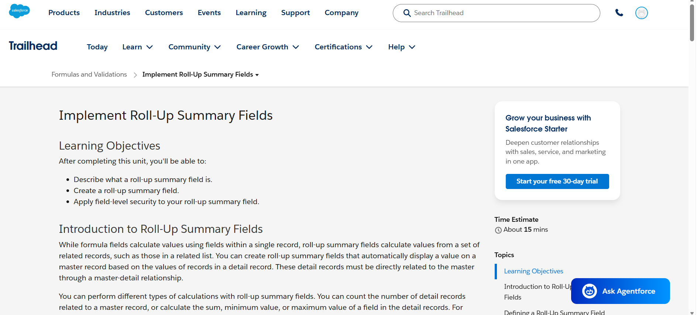
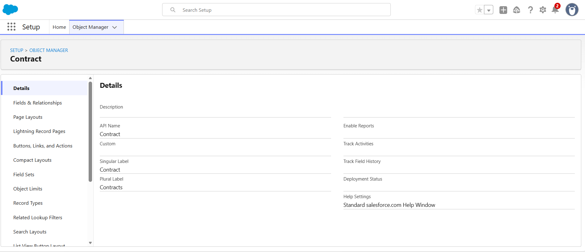
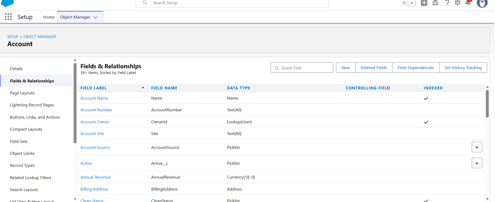

# Salesforce Summer Program - Day 3
## Data Modeling, Formula Fields, Roll-Up Summary Fields, and Validation Rules

## Goal of the Day

The goal of Day 3 is to understand how Salesforce stores and manages business data using objects, fields, records, and relationships. Today I learned about data modeling, formula fields, roll-up summary fields, validation rules, and why enterprise systems need structured data instead of random spreadsheets.

---

## Topics Covered

- Objects, Fields, and Records
- App vs Object vs Tab
- Standard Objects and Custom Objects
- Relationships in Salesforce
- Schema Builder
- Formula Fields
- Roll-Up Summary Fields
- Validation Rules
- Structured Enterprise Data
- College Management System Data Model

---

## 1. Difference Between App, Object, Record, and Field

| Term | Meaning | Example in College Management System |
|---|---|---|
| App | An app is a collection of objects, tabs, and features used for a particular business process. | College Management App |
| Object | An object is like a table that stores a specific type of data. | Student, Faculty, Course, Department |
| Record | A record is one row of data inside an object. | One student record: Krishna, CSE, 2nd Year |
| Field | A field is one column/detail inside an object. | Student Name, Email, Roll Number, Course |

In simple words, an app contains objects, objects contain records, and records contain fields.

---

## 2. App vs Object vs Tab

| Concept | Explanation | Example |
|---|---|---|
| App | A group of related objects and features used for a business process. | College Management App |
| Object | Stores a particular type of information. | Student object |
| Tab | A tab is used to open and view an object easily in Salesforce. | Student tab |

For example, in a College Management App, the Student tab helps users open the Student object and view student records.

---

## 3. Standard Objects vs Custom Objects

| Standard Objects | Custom Objects |
|---|---|
| Standard objects are already provided by Salesforce. | Custom objects are created by users based on business needs. |
| They are commonly used in many organizations. | They are specific to a particular system or organization. |
| Examples: Account, Contact, Lead, Opportunity | Examples: Student, Faculty, Course, Department |

For my College Management System, objects like Student, Faculty, Course, and Department are custom objects because they are created according to college requirements.

---

## 4. College Management System Data Model

For this task, I designed a College Management System. The main objects in this system are:

1. Student
2. Faculty
3. Course
4. Department

These objects are related to each other because a real college system contains connected information. For example, students belong to departments, faculty members work in departments, and courses are offered by departments.

---

## 5. Objects and Fields

### Object 1: Student

| Field Name | Field Type | Description |
|---|---|---|
| Student Name | Text | Stores the full name of the student |
| Roll Number | Text | Stores the unique roll number of the student |
| Email | Email | Stores the student email address |
| Phone Number | Phone | Stores the student contact number |
| Age | Number | Stores the age of the student |
| Gender | Picklist | Stores gender such as Male, Female, or Other |
| Year | Picklist | Stores year like 1st Year, 2nd Year, 3rd Year, 4th Year |
| Department | Lookup Relationship | Connects student with department |
| Course | Lookup Relationship | Connects student with course |

---

### Object 2: Faculty

| Field Name | Field Type | Description |
|---|---|---|
| Faculty Name | Text | Stores the full name of the faculty member |
| Faculty ID | Text | Stores unique faculty ID |
| Email | Email | Stores faculty email address |
| Phone Number | Phone | Stores faculty contact number |
| Subject | Text | Stores the subject handled by faculty |
| Experience | Number | Stores faculty experience in years |
| Department | Lookup Relationship | Connects faculty with department |

---

### Object 3: Course

| Field Name | Field Type | Description |
|---|---|---|
| Course Name | Text | Stores the name of the course |
| Course Code | Text | Stores unique course code |
| Course Duration | Text | Stores the duration of the course |
| Total Seats | Number | Stores the total number of seats available |
| Filled Seats | Number | Stores the number of seats already filled |
| Remaining Seats | Formula | Automatically calculates available seats |
| Department | Lookup Relationship | Connects course with department |

---

### Object 4: Department

| Field Name | Field Type | Description |
|---|---|---|
| Department Name | Text | Stores the name of the department |
| Department Code | Text | Stores short code like CSE, ECE, IT |
| HOD Name | Text | Stores the name of the Head of Department |
| Department Email | Email | Stores department official email |
| Block Name | Text | Stores the building/block name of department |

---

## 6. Relationships Between Objects

| Relationship | Relationship Type | Explanation |
|---|---|---|
| Department to Student | One-to-Many | One department can have many students |
| Department to Faculty | One-to-Many | One department can have many faculty members |
| Department to Course | One-to-Many | One department can offer many courses |
| Course to Student | One-to-Many | One course can have many students |

I would use Lookup Relationships between these objects because the objects can exist independently. For example, if a course is changed, the student record should not be deleted. Lookup relationship provides flexibility and connects related data without making the objects fully dependent on each other.

---

## 7. Data Model Diagram

Department  
&nbsp;&nbsp;&nbsp;|  
&nbsp;&nbsp;&nbsp;|--- Student  
&nbsp;&nbsp;&nbsp;|  
&nbsp;&nbsp;&nbsp;|--- Faculty  
&nbsp;&nbsp;&nbsp;|  
&nbsp;&nbsp;&nbsp;|--- Course  
&nbsp;&nbsp;&nbsp;&nbsp;&nbsp;&nbsp;&nbsp;&nbsp;&nbsp;&nbsp;|  
&nbsp;&nbsp;&nbsp;&nbsp;&nbsp;&nbsp;&nbsp;&nbsp;&nbsp;&nbsp;|--- Student  

### Diagram Explanation

In this College Management System, Department is connected with Student, Faculty, and Course. One department can have many students, many faculty members, and many courses. A course can also have many students. This structure helps to store college data in an organized and connected way.

---

## 8. Schema Builder

Schema Builder is a Salesforce tool used to view and understand the data model visually. It helps us see objects, fields, and relationships in one place.

In a real system, Schema Builder is useful because it gives a clear picture of how different objects are connected. Instead of checking each object separately, we can understand the complete structure of the system visually.

---

## 9. Formula Fields

Formula fields are used to automatically calculate values based on other fields. They reduce manual work and avoid calculation mistakes.

### Formula Field 1: Full Name

Formula: First Name + Last Name

Explanation: This formula automatically combines the first name and last name of a student. It avoids typing the full name manually again and again.

### Formula Field 2: Remaining Seats

Formula: Total Seats - Filled Seats

Explanation: This formula automatically calculates how many seats are still available in a course. It helps the college quickly know course availability.

### Formula Field 3: Percentage

Formula: (Marks Obtained / Total Marks) * 100

Explanation: This formula automatically calculates the student percentage. It saves time and prevents manual calculation mistakes.

---

## 10. Trailhead Formula Field Challenge

### Challenge Name

Create a Formula Field

### Object

Contract

### Field Details

| Field | Value |
|---|---|
| Object | Contract |
| Data Type | Formula |
| Field Label | Days Remaining |
| Field Name | Days_Remaining |
| Formula Return Type | Number |

Formula: EndDate - TODAY()

Explanation: This formula calculates the number of days remaining before a contract expires. It subtracts today's date from the contract end date. This helps users quickly know how many days are left for the contract.

---

## 11. Roll-Up Summary Fields

A roll-up summary field calculates values from related child records and displays the result on the parent record. Roll-up summary fields work with master-detail relationships.

Roll-up summary fields can perform calculations like COUNT, SUM, MIN, and MAX.

Example: If one Account has many Opportunities, a roll-up summary field can calculate the total expected revenue from all related opportunities and show it on the Account record.

---

## 12. Trailhead Roll-Up Summary Field Challenge

### Challenge Name

Create a Roll-Up Summary Field

### Object

Account

### Field Details

| Field | Value |
|---|---|
| Object | Account |
| Field Type | Roll-Up Summary |
| Field Label | Potential Value |
| Field Name | Potential_Value |
| Summarized Object | Opportunities |
| Roll-Up Type | SUM |
| Field to Aggregate | Expected Revenue |
| Filter Criteria | All records should be included |

Explanation: This roll-up summary field calculates the total expected revenue of all opportunities related to an account. It helps the company quickly understand the total potential value of each account.

---

## 13. Validation Rules

Validation rules are used to prevent wrong or invalid data from being saved in Salesforce. A validation rule checks a condition and shows an error message when the entered data is invalid.

Validation rules help maintain clean, correct, and reliable data.

---

## 14. Validation Rules for College Management System

### Validation Rule 1: Email Cannot Be Empty

Rule: Email should not be blank.

Problem Prevented: This prevents student or faculty records from being created without an email address. Email is important for communication.

---

### Validation Rule 2: Student Age Cannot Be Negative

Rule: Age should be greater than 0.

Problem Prevented: This prevents invalid age values like -5 or 0 from being entered.

---

### Validation Rule 3: Course Seats Cannot Exceed Limit

Rule: Filled Seats should not be greater than Total Seats.

Problem Prevented: This prevents a course from showing more students than the actual seat capacity.

---

## 15. Trailhead Validation Rule Challenge

### Challenge Name

Create a Validation Rule

### Object

Contact

### Rule Details

| Field | Value |
|---|---|
| Object | Contact |
| Rule Name | Contact_must_be_in_Account_ZIP_Code |
| Error Location | Mailing Zip/Postal Code |

Error Condition Formula:

AND(
    NOT(ISBLANK(AccountId)),
    MailingPostalCode <> Account.ShippingPostalCode
)

Error Message: Contact Mailing Zip Code must match the Account Shipping Zip Code.

Explanation: This validation rule prevents users from creating or updating a contact when the contact mailing zip code is different from the related account shipping zip code. It still allows contacts that do not have an associated account.

---

## 16. Why Companies Need Structured Data Instead of Random Spreadsheets

Companies need structured data because it helps them store, search, update, and analyze information properly. If data is stored randomly in spreadsheets, it becomes difficult to manage when the company grows. There may be duplicate data, wrong entries, missing values, and confusion between teams.

In Salesforce, data is stored using objects, fields, records, and relationships. This makes the system organized and reliable. For example, in a college system, students, faculty, courses, and departments are connected. Because of this structure, we can easily know which student belongs to which department, which faculty teaches which subject, and how many seats are available in a course.

Structured data also helps in automation, reporting, validation, and decision-making. It reduces manual work and prevents errors.

---

## 17. Reflective Questions

### 1. Why can’t companies manage everything using Excel sheets?

Companies cannot manage everything using Excel sheets because Excel becomes difficult to handle when data increases. Multiple people may edit different versions, data may become duplicate, and mistakes are hard to track. Excel is useful for small tasks, but large companies need secure, structured, and connected systems like Salesforce.

---

### 2. Why are relationships important between objects?

Relationships are important because real-world data is connected. For example, a student belongs to a department, a faculty member works in a department, and a course is offered by a department. Relationships help connect this data and make it easy to understand the complete information.

---

### 3. What problems happen if data is inconsistent?

If data is inconsistent, wrong decisions may be taken. For example, if one sheet says a course has 60 seats and another says 80 seats, it creates confusion. Inconsistent data can cause duplicate records, wrong reports, communication problems, and loss of trust in the system.

---

### 4. Why should repetitive calculations be automated?

Repetitive calculations should be automated because manual calculations take time and may contain mistakes. Formula fields automatically calculate values like percentage, remaining seats, and full name. This saves time and improves accuracy.

---

### 5. Why should invalid data be blocked early?

Invalid data should be blocked early because wrong data can create bigger problems later. For example, if negative age or wrong email is allowed, reports and communication may become incorrect. Validation rules help stop mistakes before saving the record.

---

### 6. Why is Salesforce called a metadata-driven platform?

Salesforce is called a metadata-driven platform because many things are controlled by configuration instead of only code. Objects, fields, page layouts, validation rules, automation, and relationships are stored as metadata. This means we can customize Salesforce using clicks and settings without writing code for everything.

---

## 18. Learnings from Today

- I learned the difference between App, Object, Record, and Field.
- I understood the difference between Standard Objects and Custom Objects.
- I learned how relationships connect different objects.
- I understood how Schema Builder helps to visualize objects and relationships.
- I understood how Formula Fields automate calculations.
- I learned how Roll-Up Summary Fields summarize related records.
- I learned how Validation Rules prevent wrong data.
- I understood why structured data is important in enterprise systems.
- I understood how Salesforce supports no-code business logic.

---

## 19. Screenshots

Create a folder named `screenshots` inside `day3-data-modeling` and upload only these screenshots.

### Screenshot Folder Structure

day3-data-modeling/  
│  
├── README.md  
└── screenshots/  
&nbsp;&nbsp;&nbsp;&nbsp;├── s1.png  
&nbsp;&nbsp;&nbsp;&nbsp;├── s2.png  
&nbsp;&nbsp;&nbsp;&nbsp;├── s3.png  
&nbsp;&nbsp;&nbsp;&nbsp;└── data_model_basics.png  

---

### Screenshot 1: Roll-Up Summary Fields Trailhead Page

---

### Screenshot 2: Contract Object in Object Manager

---

### Screenshot 3: Account Fields and Relationships

---

### Screenshot 4: Schema Builder Data Model

---

## 20. GitHub Submission Structure

The final GitHub folder should look like this:

salesforce-training/  
└── week1/  
&nbsp;&nbsp;&nbsp;&nbsp;└── day3-data-modeling/  
&nbsp;&nbsp;&nbsp;&nbsp;&nbsp;&nbsp;&nbsp;&nbsp;├── README.md  
&nbsp;&nbsp;&nbsp;&nbsp;&nbsp;&nbsp;&nbsp;&nbsp;└── screenshots/  
&nbsp;&nbsp;&nbsp;&nbsp;&nbsp;&nbsp;&nbsp;&nbsp;&nbsp;&nbsp;&nbsp;&nbsp;├── s1.png  
&nbsp;&nbsp;&nbsp;&nbsp;&nbsp;&nbsp;&nbsp;&nbsp;&nbsp;&nbsp;&nbsp;&nbsp;├── s2.png  
&nbsp;&nbsp;&nbsp;&nbsp;&nbsp;&nbsp;&nbsp;&nbsp;&nbsp;&nbsp;&nbsp;&nbsp;├── s3.png  
&nbsp;&nbsp;&nbsp;&nbsp;&nbsp;&nbsp;&nbsp;&nbsp;&nbsp;&nbsp;&nbsp;&nbsp;└── data_model_basics.png  

---

## 21. Conclusion

By completing Day 3, I understood how Salesforce stores business data using objects, fields, records, and relationships. I also learned how formula fields, roll-up summary fields, and validation rules help in creating business logic without coding. This task helped me understand why structured enterprise data is important for real-world business systems.
